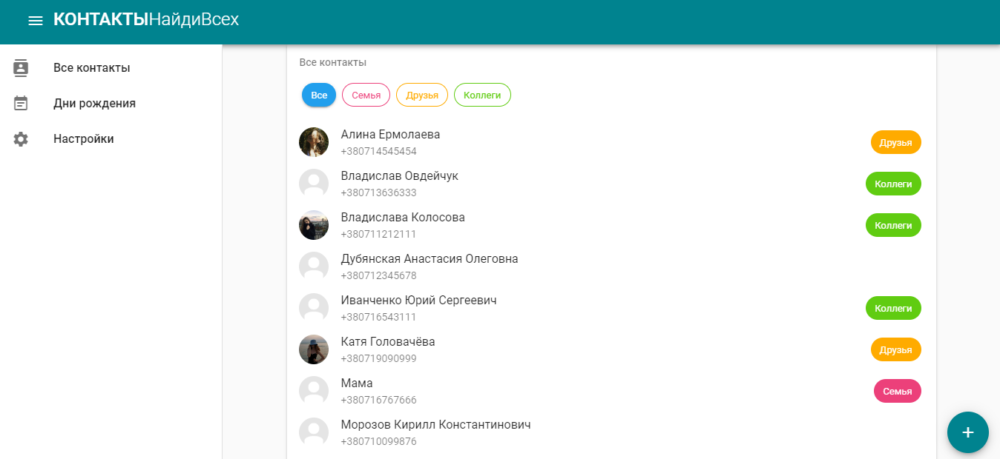

# contacts
Данное веб-приложение позволяет управлять списком ваших контактов.

Приложение доступно онлайн: https://vladamamutova.github.io/contacts/.

# Особенности
- Список контактов сохраняется в local storage, поэтому при обновлении страницы браузера и его перезапуске данные сохраняются *(до очистки истории просмотров и файлов cookie за всё время в браузере)*
- В приложении предусмотрены метки (семья, друзья, коллеги), позволяющие группировать и фильтровать контакты
- Приложение выводит список дней рождения
- Приложение разработано в соотвествии с принципами Material Design при помощи фреймворка Vuetify

<div align="center">

</div>

## Project setup
```
npm install
```

### Compiles and hot-reloads for development
```
npm run serve
```

### Compiles and minifies for production
```
npm run build
```

### Run your tests
```
npm run test
```

### Lints and fixes files
```
npm run lint
```

### Customize configuration
See [Configuration Reference](https://cli.vuejs.org/config/).
